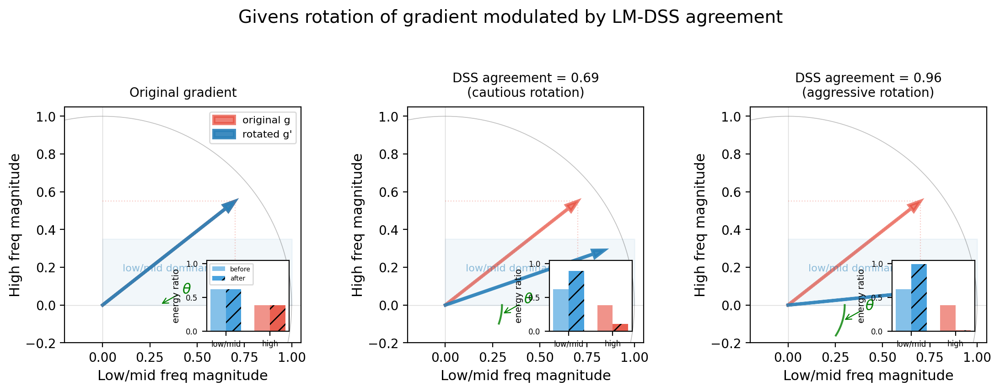

# DIM Adjoint Echo 数据增强 与 LM-DSS + Rotation 梯度调优

## 一、概览：两个方法在管线中的位置

每一步攻击迭代中，数据处理顺序如下：

```
前向传播（数据增强）                 反向传播（梯度调优）
                                     
输入图像 x                              
  │                                    
  ├── DIM (input_diversity)            ← 第1层前向增强
  ├── SI (scale-invariant)             ← 第2层前向增强
  ├── EOT (expectation transform)      ← 第3层前向增强
  └── guide_aug:                       ← 第4层前向增强
      ├── dropout / jitter / ...
      ├── dim_resonance
      ├── dim_adjoint_echo             ═══ 本文方法 1
      └── wavelet / white noise ...
           │
           ▼
      model(x) → loss
           │
           ▼
      计算梯度 g
           │
      ═══  dim_adjoint_echo 的后效：     ← g → g + γ·JᵀJ(g)
      ═══   梯度被隐式低通平滑
           │
      ├── normalize_grad               
      ├── smooth_grad (TI-FGSM)        
      ├── apply_lowmid_dss_filter       ═══ 本文方法 2a：只度量
      ├── tune_lowmid_gradient           ═══ 本文方法 2b：真正修改
      ├── temporal_persistence          
      ├── momentum / GRM               
      └── update.sign() → 像素更新      
```

---

## 二、DIM Adjoint Echo 数据增强

### 2.1 核心思想

> **前向等价于原图（不移动 loss 评估点），反向传播时梯度多一项 γ·JᵀJ(g)，等价于对梯度做模型无关的低通平滑。**

### 2.2 细粒度实现

```python
def _dim_adjoint_restore_pixels(self, pixels):
    # ① 随机采样 DIM 参数
    new_h, new_w, top, left = self._sample_dim_params(pixels)
    
    # ② 前向 DIM：J(x) = resize → pad
    transformed = self._apply_dim_transform(pixels, (new_h, new_w, top, left))
    
    # ③ crop → resize 回原尺寸：Jᵀ(J(x))
    cropped = transformed[..., top:top+new_h, left:left+new_w]
    return F.interpolate(cropped, size=(height, width), ...)

def _dim_adjoint_echo_pixels(self, pixels):
    restored = self._dim_adjoint_restore_pixels(pixels)  # JᵀJ(x)
    augmented = pixels + gamma * restored                  # x + γ·JᵀJ(x)
    
    # ★ 梯度技巧
    return (augmented + (pixels - augmented).detach())
```

**detach 技巧的分支行为：**

| 方向 | 流过哪一支 | 等效结果 |
|------|-----------|---------|
| 前向 | `augmented + (x - augmented)` | `= x` |
| 反向 | 只流过 `augmented`（另一支被 detach 切断） | `g' = g + γ·JᵀJ(g)` |

### 2.3 数值例子

设 2×2 单通道图像，DIM 参数 scale=0.5，top=0, left=0：

**Step 1-3：JᵀJ(x) 的计算链**

```
x = [[1.0, 0.0],        resize           padded           cropped
     [0.0, 0.0]]    ―――――――→  [[0.25]] ―→  [[0.25, 0.0]] ―→  [[0.25]]
     (原始图像)          2×2→1×1       pad(0,1,0,1)       crop(0,0)
     
     resize back
     ―――――――――→  JᵀJ(x) = [[0.25, 0.25],
     1×1→2×2                [0.25, 0.25]]
```

**Step 4：构造 augmented（γ = 0.3）**

```
augmented = x + 0.3 × JᵀJ(x)
          = [[1.0, 0.0]    + [[0.075, 0.075]
             [0.0, 0.0]]      [0.075, 0.075]]
          = [[1.075, 0.075],
             [0.075, 0.075]]
```

**Step 5：detach——前向恒等**

```
forward = augmented + (x - augmented).detach()
        = augmented + [[-0.075, -0.075],           ← 常数
                       [-0.075, -0.075]]
        = [[1.0, 0.0],                             ← 等价于 x
           [0.0, 0.0]]
```

**Step 6：反向传播——梯度回波**

假设来自 loss 的原始梯度 g：

```
g = ∂L/∂x = [[-2.0,  0.5],
             [ 0.5,  0.5]]
```

JᵀJ(g) 计算：
```
① resize 2×2→1×1：mean = (-2.0 + 0.5 + 0.5 + 0.5)/4 = -0.125
② restore 回 2×2：JᵀJ(g) = [[-0.125, -0.125],
                              [-0.125, -0.125]]
```

最终梯度的反向等效值：
```
g_total = g + 0.3 × JᵀJ(g)
        = [[-2.0375,  0.4625],      ← 左上角稍增强，其他被拉向均值
           [ 0.4625,  0.4625]]
```

**效果：** 右上和右下像素的梯度从+0.5被衰减到+0.4625，差异缩小，**高频空间模式被平滑**。

### 2.4 为什么 scale=0.85 时更有趣

当 scale=0.85（默认范围下限），4×4 → resize 3×3 → resize back 4×4 时，JᵀJ 不再输出均匀矩阵，而是**高斯状的低通核**——近邻像素通过双线性插值混合，等效于对梯度 g 做了一次空间平滑，保留低/中频、衰减高频。这正是 DIM 能提升迁移性的核心原因。

### 2.5 与 dim_resonance 的区别

| 方法 | 前向 | 反向 | 本质 |
|------|------|------|------|
| `dim_resonance` | `x + γ·JᵀJ(x)` 的非DC成分 | 正常反向 | 修改了前向图像 |
| `dim_adjoint_echo` | **恒等于 x** | `g + γ·JᵀJ(g)` | 不移动 loss 评估点，只改梯度路径 |

---

## 三、LM-DSS + Sign + Rotation 梯度调优

### 3.1 核心思想

> 检查当前梯度的低/中频方向是否与历史动量方向稳定一致，根据一致性程度**动态调节 Givens 旋转力度**，把梯度能量从不可迁移的高频噪声转移到可迁移的低/中频信号。

### 3.2 两个步骤（度量 + 修改）

| 步骤 | 方法 | 做了什么 | 修改梯度？|
|:----:|------|---------|:--------:|
| a | `_apply_lowmid_dss_filter()` | 比较当前梯度 vs 动量缓冲的低/中频符号一致性，产出一致性分数 | ❌ 只度量 |
| b | `_tune_lowmid_gradient()` | 用一致性分数调制旋转强度，做 Givens 旋转 | ✅ 修改 |

### 3.3 数值例子

**场景：** 一个 4×4 单通道梯度张量

#### Step a：LM-DSS Sign 一致性度量

```
当前梯度 G = [[ 1.0,  0.8,  0.2,  0.1],
               [ 0.7,  0.9,  0.3, -0.1],
               [ 0.1,  0.0,  0.5,  0.4],
               [-0.2,  0.1,  0.6,  0.8]]
```

FFT 分解后得到低/中频成分：

```
G_LM = [[ 0.7,  0.6,  0.1,  0.0],
         [ 0.5,  0.7,  0.2, -0.1],
         [ 0.0, -0.1,  0.4,  0.3],
         [-0.1,  0.0,  0.4,  0.6]]

动量低/中频 M_LM = [[ 0.5,  0.4,  0.0, -0.1],
                      [ 0.3,  0.5,  0.1,  0.0],
                      [ 0.0, -0.1,  0.3,  0.2],
                      [ 0.0,  0.1,  0.3,  0.4]]
```

按元素比较符号一致性：
```
sign(G_LM) == sign(M_LM):
[[ ✓,  ✓,  ✗,  ✓],
 [ ✓,  ✓,  ✓,  ✗],
 [ ✓,  ✓,  ✓,  ✓],
 [ ✗,  ✗,  ✓,  ✓]]       → 一致率 = 12/16 = 0.75
```

agreement = 0.75：当前梯度低/中频方向与历史 75% 一致——较稳定。

#### Step b：Givens 旋转（核心变换）

旋转强度由 base_strength 和 agreement 共同决定：
```
effective_strength = base × agreement = 0.5 × 0.75 = 0.375
```

以像素 (0,0) 为例——当前低/中频范数=0.7，高频范数=0.3：

```
θ = 0.375 × atan2(0.3, 0.7) = 0.375 × 0.405 = 0.152 rad

旋转后低/中频 = 0.7 × cos(0.152) + 0.3 × sin(0.152) = 0.735  ↑
旋转后高频   = -0.7 × sin(0.152) + 0.3 × cos(0.152) = 0.199  ↓
```

低/中频从 0.70 → 0.735（↑5%），高频从 0.30 → 0.199（↓34%），能量从高频向低/中频转移。

#### Step c：取 sign 做像素更新

旋转后的梯度经过后续归一化，最终 `.sign()` 决定更新方向：

```
update = rotated_gradient.sign()   → 每个像素 ±1
adv_pixels += step_size × update
```

### 3.4 旋转示意图

下图展示了 Givens 旋转的效果，DSS agreement 信号如何调控旋转角度：



- **左图（θ = 0）：** 无旋转，梯度保持原始方向
- **中图（DSS agreement = 0.69）：** 中等一致性，适度旋转，部分能量转向低/中频轴
- **右图（DSS agreement = 0.96）：** 高度一致性，强旋转，大部分能量集中到低/中频

每个图右下角的能量分布柱状图显示旋转前后的低/中频 vs 高频能量占比变化。

---

## 四、dim_adjoint_echo 和 LM-DSS+rotation 的关系

| 维度 | dim_adjoint_echo | LM-DSS + rotation |
|:----:|:----------------:|:-----------------:|
| **方法类型** | 数据增强（修改梯度路径） | 梯度调优 |
| **介入阶段** | 前向传播（在 model forward 前） | 反向传播后（在 momentum 前） |
| **对齐维度** | 对同一张图的 DIM 正反变换 | 当前梯度 vs 历史动量之间 |
| **频域操作** | 隐式低通（JᵀJ 的固有属性） | 显式低通（FFT分解+Givens旋转） |
| **机制** | detach 技巧：前向恒等，反向加γ·JᵀJ(g) | 度量一致性→调旋转强度→能量位移 |
| **核心参数** | `guide_aug_strength` (γ) | `guide_aug_strength` 调制强度 |

两个方法虽然都在处理频域，但**作用维度不同**：
1. **dim_adjoint_echo** 作用于**单个样本的梯度路径**，用模型无关的 DIM 几何结构做隐式低通
2. **LM-DSS + rotation** 作用于**时间步之间的方向稳定性**，用历史信息显式旋转梯度频谱

两者可以叠加使用：前者先对每个样本的梯度做 DIM 伴随平滑，后者再根据跨时间步的稳定性进一步将梯度能量集中到低/中频。
